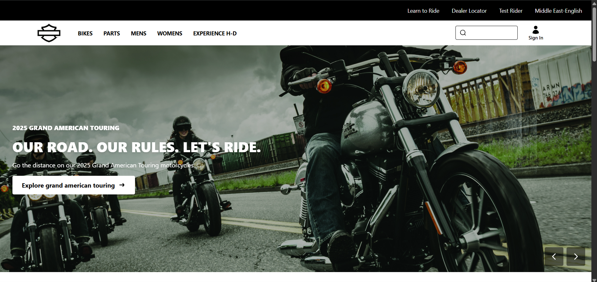
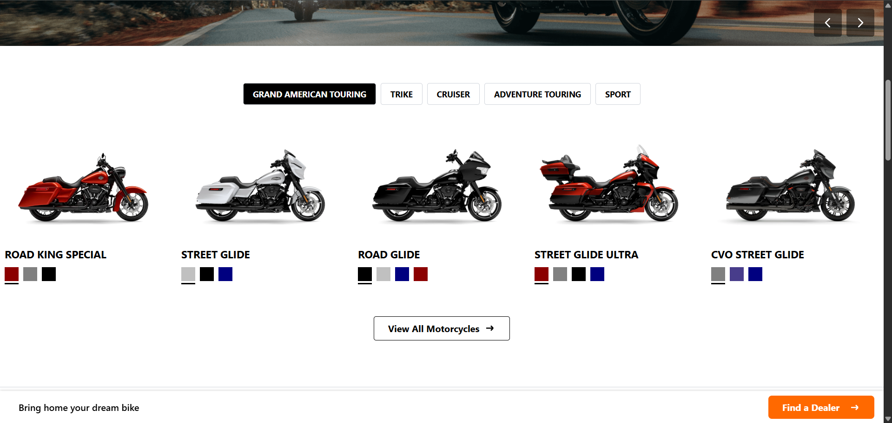
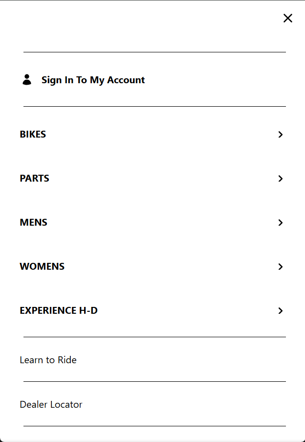
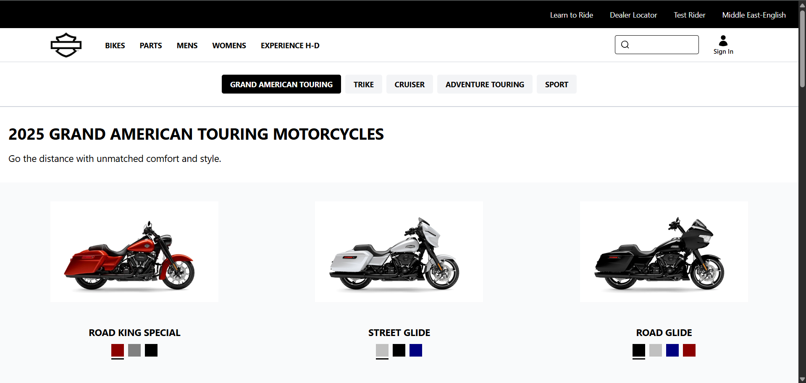
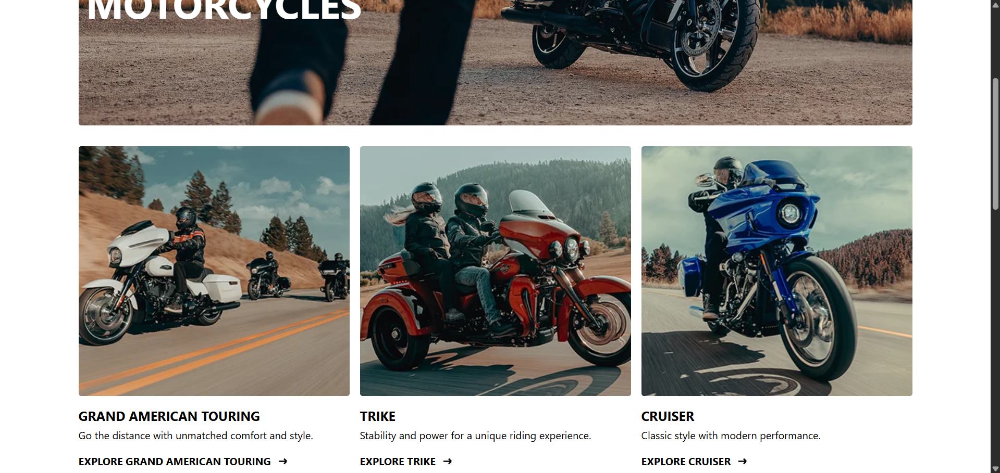
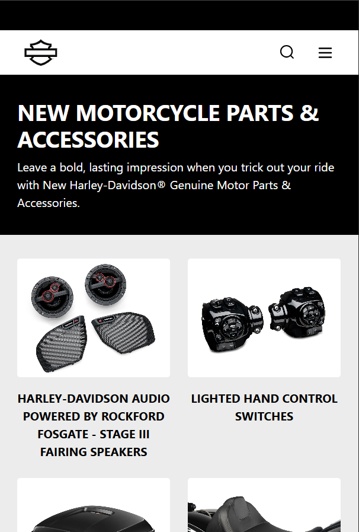
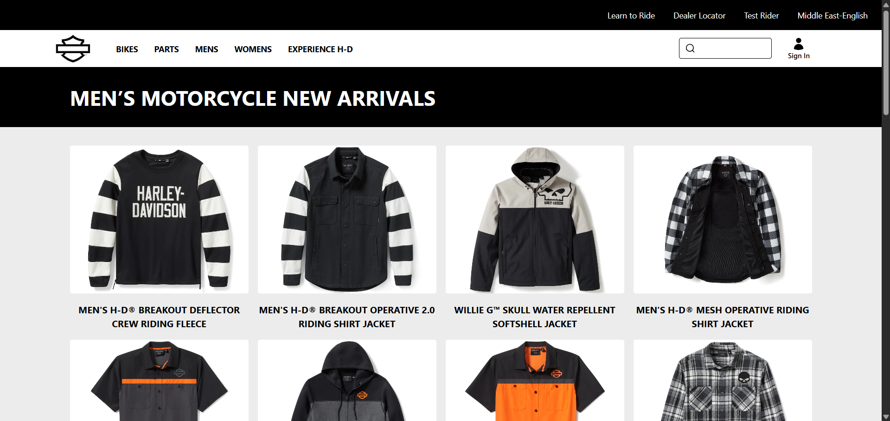
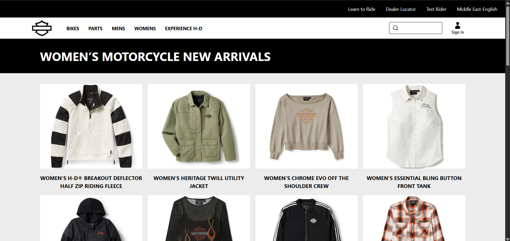
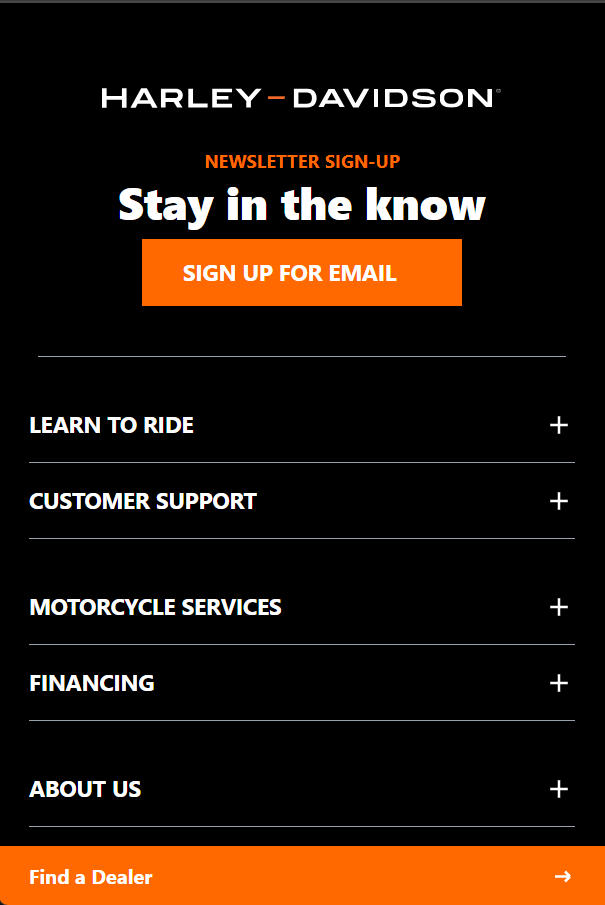
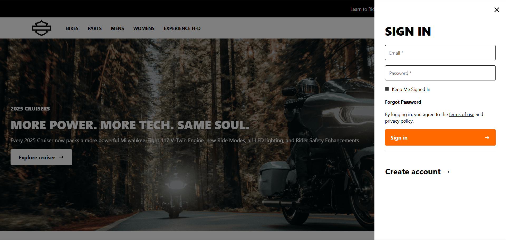

# Harley-Davidson Inspired E-Commerce Site

A front-end React project mimicking the Harley-Davidson website's bold style and functionality, showcasing motorcycles, gear, and accessories. Built with React, Tailwind CSS, `framer-motion`, and `react-router-dom`. Uses mock data, no backend or database.

## Features
- **Responsive Design**: Mobile-first with Tailwind CSS. Grids adapt: 1-2 columns on mobile, 3-4 on desktop.
- **Navbar**: Logo links to home, navigation for BIKES, PARTS, MENS, WOMENS. Includes sign-in form, mobile hamburger menu, search input, and orange hover effects.
- **Footer**: Logo, newsletter sign-up, mobile accordion sections (Learn to Ride, Customer Support, etc.), language selector (17 options), social icons, and policy links.
- **Homepage**: Hero carousel with swipe and auto-scroll, category selector, product carousel, links to bikes and apparel, sticky "Find a Dealer" navbar.
- **Bikes Page**: Category selector, product grid, and static section linking to apparel/accessories.
- **Bike Categories Page**: Hero image with category cards linking to filtered bike pages.
- **Accessories, Men's, Women's Pages**: Black headers, `#ececec` background, square product card grids.
- **Interactivity**: URL-based category filtering, `framer-motion` animations for carousels, menus, and dropdowns, touch swipe support, auto scroll-to-top on navigation.

## Live Demo

[Click here to view the demo](https://harley-davidson-app.vercel.app/)


## Screenshots

- **Homepage**:
  
  
  

- **Mobile Menu**:
  

- **Bikes Page on desktop**:
  

- **Bike Categories Page**:
  

- **Accessories Page on mobile**:
  

- **Men's Apparel Page**:
  

- **Women's Apparel Page**:
  

- **Footer on mobile**:
  

- **Sign-in Form**:
  

## Tech Stack
- **React.js**: UI components and state management.
- **Tailwind CSS**: Responsive styling.
- **framer-motion**: Animations for carousels, menus, and dropdowns.
- **react-router-dom**: Routing and URL parameter handling.

## Setup & Running
1. Clone the repo:
 ```bash
   git clone https://github.com/Dana-Mazen/Harley-Davidson-app.git
   cd harley-davidson-app
```
2. Install dependencies:
```bash
npm install
```
3.Run the dev server:
```bash
npm run start
```
4.Build for production:
```bash
npm run build
```
## Data Sources
- Mock data in /src/data/ (bikes.js, categories.js, accessories.js, mens.js, womens.js) for products and categories.

## Known Issues & Improvements
- Product Pages: Skipped for front-end focus.
- Search Input: Placeholder.
- Footer Links: Placeholders.
- Performance: Compress images (/assets/*.png) for faster mobile loads.

## Credits
Inspired by Harley-Davidson. All assets and data are mock.

- **AUTHOR :** Dana Mazen
